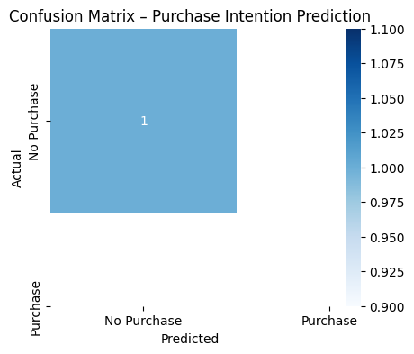

# 🛒 E-commerce Purchase Intention Prediction

## 📌 Project Overview
This project predicts whether an online shopper will make a purchase based on their browsing behavior and session-level data. The goal is to help e-commerce businesses understand customer intent and improve conversion rates.

## 🎯 Problem Statement
Given user behavior features such as page visits, duration, bounce rates, and special days, predict whether the user will generate revenue.

## 🛠️ Tools & Technologies
- Python
- Pandas, NumPy
- Matplotlib, Seaborn
- Scikit-learn

## 📊 Dataset
- Dataset: Online Shoppers Purchasing Intention Dataset
- Source: UCI Machine Learning Repository
- Target Variable: **Revenue** (Purchase / No Purchase)

🔗 Original dataset:
https://archive.ics.uci.edu/ml/datasets/Online+Shoppers+Purchasing+Intention+Dataset


## 🔄 Project Workflow
1. Data Loading
2. Data Cleaning & Preprocessing
3. Exploratory Data Analysis (EDA)
4. Feature Encoding & Scaling
5. Model Building
6. Model Evaluation
7. Final Prediction

## 🧠 Machine Learning Models Used
- Logistic Regression
- Decision Tree
- Random Forest

## 📈 Exploratory Data Analysis & Results

### Class Distribution


### Confusion Matrix


### Model Accuracy Comparison


## 📈 Business Impact
This model can help e-commerce platforms:
- Identify high-intent customers
- Improve marketing strategies
- Increase conversion rates

## 📎 Conclusion
This project demonstrates an end-to-end classification workflow using real-world e-commerce data.

```markdown
⭐ If you found this project useful, feel free to star the repository!
